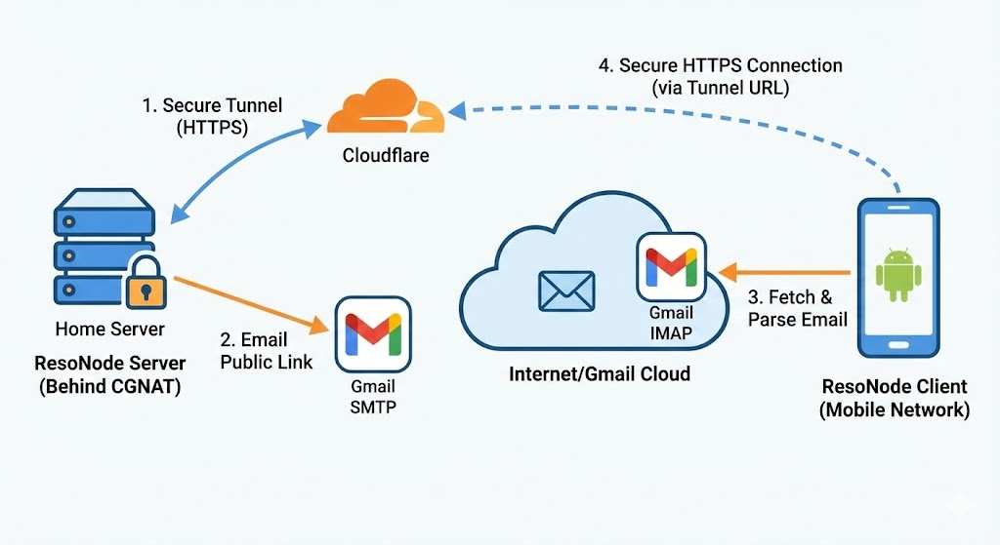

# ResoNode

**Self-hosted music streaming without barriers.**

ResoNode is a self-hosted music streaming platform designed to provide full control over a personal music library. It serves as an alternative to commercial streaming services, allowing users to host their own server and access their music remotely without subscriptions, ads, or data tracking.

## Overview

Unlike other media servers like Plex or Jellyfin, ResoNode is built with a specific focus on resilience and connection simplicity for users with dynamic IPs.

* **Data Sovereignty:** You host the MP3 files. The library is not subject to licensing agreements or removals.
* **Connection Mechanism:** Removes the need for static IPs, dynamic DNS (DDNS), or complex VPN configurations (like WireGuard/Tailscale). It uses a discovery system based on Cloudflare Tunnels and Gmail to locate the server automatically.
* **Hybrid Playback:**
    * **Streaming:** Plays directly from the server when an internet connection is available.
    * **Offline Mode:** Downloads playlists to local storage. The app manages the local database transparently, switching modes automatically when network connectivity is lost.
* **The Vault:** An automated file system that organizes uploads by Artist, Album, and Track.
* **Legacy Support:** Includes a custom TLS 1.2 socket factory implementation, allowing the client to run on older Android devices (Android 4.4+) as dedicated media players.

## System Architecture

The project consists of two main components:

1.  **Server (Python/FastAPI):** Runs on a host machine (Linux/Windows/Mac). Manages the file system, user authentication, and streaming logic.
2.  **Client (Android):** A native application optimized for low-latency streaming and offline synchronization.

### The Connection Logic



To bypass carrier-grade NAT (CGNAT) and dynamic IPs without user intervention:

1.  **Tunneling:** Upon startup, `server_launcher.py` initiates a secure Cloudflare Tunnel (`cloudflared`).
2.  **Assignment:** Cloudflare assigns a temporary, random public URL (e.g., `https://random-id.trycloudflare.com`).
3.  **Broadcasting:** The server detects this URL and emails it to a dedicated Gmail account via SMTP.
4.  **Discovery:** When the Android app launches, it checks the Gmail inbox via IMAP, retrieves the latest email from the server, and parses the new URL.
5.  **Handshake:** The app updates its configuration and establishes the connection.

## Server Installation

### Prerequisites
* Python 3.8 or higher.
* **Cloudflared:** The Cloudflare tunnel daemon must be installed and available in the system PATH.
* **Gmail Account:** A dedicated account is recommended for the handshake process. App Passwords must be enabled.

### Setup Steps

1.  **Install Dependencies:**
    ```bash
    pip install fastapi uvicorn python-multipart mutagen requests
    ```

2.  **Configuration:**
    * Navigate to the `server/` directory.
    * Locate `server_config_example.py`.
    * Rename it to `server_config.py` (this file is git-ignored to prevent credential leakage).
    * Edit the file with your credentials:
        ```python
        API_SECRET_KEY = "YOUR_SECURE_KEY" # Must match the key in the Android App
        GMAIL_USER = "your_email@gmail.com"
        GMAIL_PASS = "your_app_password"
        DESTINATION_EMAIL = "destination_email@gmail.com"
        PORT = 8000
        ```

3.  **Run the Server:**
    Execute the launcher script from within the server directory. This will start the API, initialize the tunnel, and send the connection email.
    ```bash
    cd server
    python server_launcher.py
    ```

## Client Installation (Android)

1.  Open the project in **Android Studio**.
2.  **Security Configuration:**
    * Navigate to `app/src/main/java/com/example/resonode/`.
    * Modify the file named `Config.java` using it as a template.
    * Fill in the required fields:
        * `API_SECRET_KEY`: Must match the server key exactly.
        * `GMAIL_EMAIL` / `PASSWORD`: Credentials used to read the connection email.
3.  **Build:** compile the APK and install it on the target device.

## Uploading Music

ResoNode includes a user-friendly helper script to upload your local music library to your server without technical hassles.

### Automated Method (Recommended)

1.  Ensure your server is running.
2.  Run the uploader script from the project root:
    ```bash
    python music_uploader.py
    ```
3.  **Follow the interactive wizard:**
    * **Select Source:** Drag and drop your local music folder containing `.mp3` files into the terminal window.
    * **Select Environment:** Choose whether you are at home (Local IP) or away (Cloudflare Tunnel).
    * **Select Destination:** (Optional) Choose a specific playlist folder on the server to link the music to.

The script automatically filters for MP3s, creates a ZIP package, and handles the upload process for you.

### Manual Method (Advanced)

If you prefer to build your own tools or integrations, the server exposes the following endpoint:

* **URL:** `/upload_zip`
* **Method:** `POST`
* **Headers:** `x-secret-key: [YOUR_API_SECRET_KEY]`
* **Body (Multipart/Form-Data):**
    * `file`: A `.zip` file containing valid MP3s.
    * `target_playlist`: (Optional) Name of a subfolder/playlist.

## OTA Updates (Auto-Updater)

ResoNode includes a built-in Over-The-Air update mechanism. You don't need to manually copy APKs to your phone.

### How it works
1.  **Check:** Every time the App opens, it queries `/update/check`.
2.  **Compare:** It compares the server's `version.json` with the installed app version.
3.  **Install:** If a newer version is found, it downloads and prompts the user to install it.

### Building a new version
If you ever want to experiment and modify this app, feel free to do it! A helper script `deploy_tool.py` is included to automate this process.

1.  **Build:** Generate a Signed APK in Android Studio (`Build > Generate Signed Bundle / APK > APK > Debug/Release`).
2.  **Run:** Execute the tool from the project root:
    ```bash
    python deploy_tool.py
    ```
3.  **Follow the wizard:**
    * It detects the latest APK automatically.
    * Enter the new Version Code (must be higher than current).
    * Enter the Changelog.
    * **Select Mode:**
        * `[1] SSH/SCP`: For local network deployment (requires SSH access).
        * `[2] HTTP Upload`: Deploys via the Cloudflare Tunnel. Useful if you are coding away from home.

## Disclaimer

This project is a proof of concept regarding media streaming and network traversal. Users are responsible for ensuring they have the legal rights to the media files hosted, streamed, and downloaded on their private servers.
