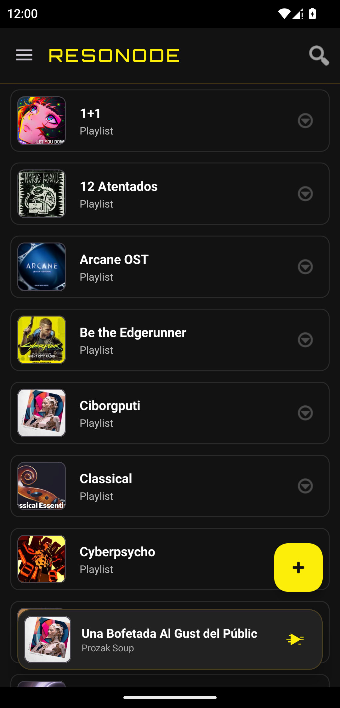
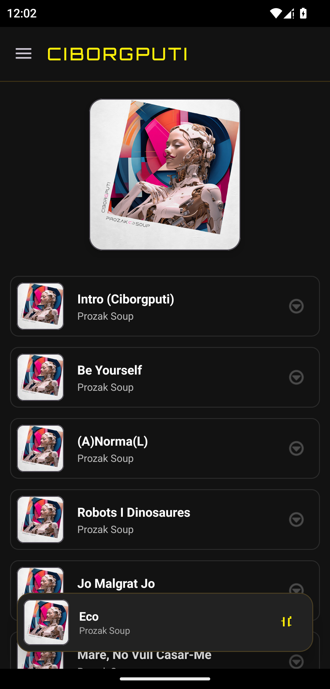
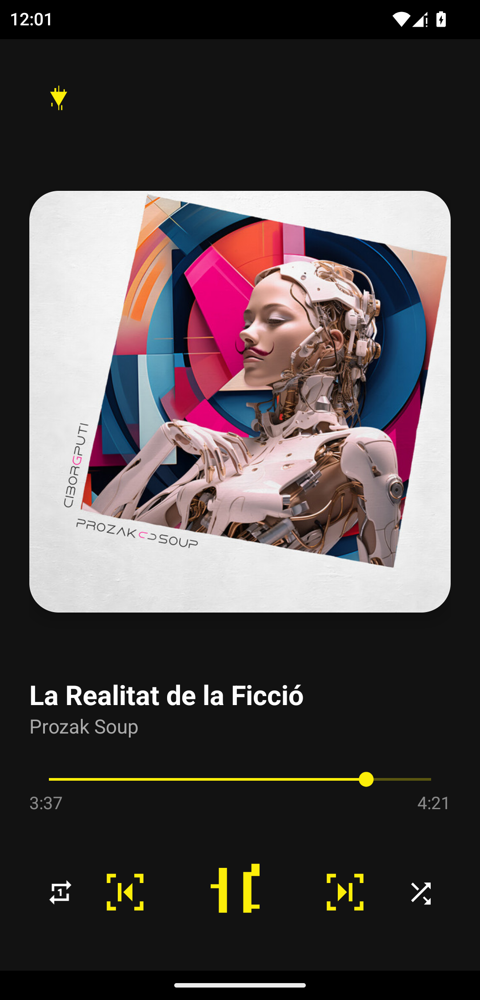
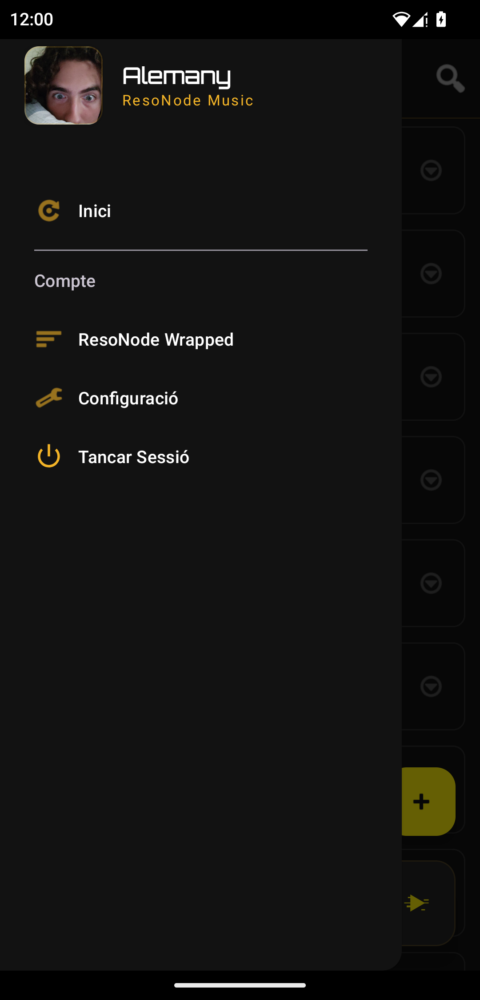
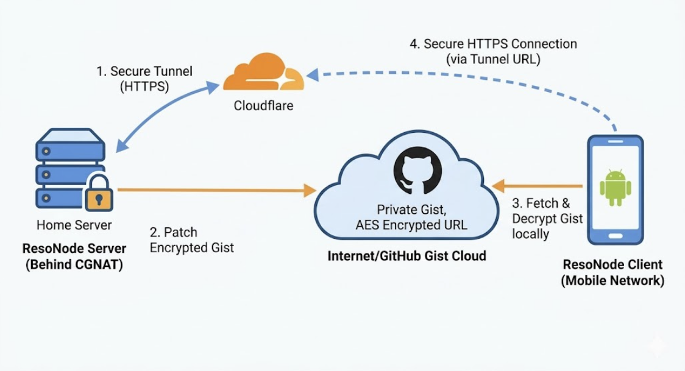
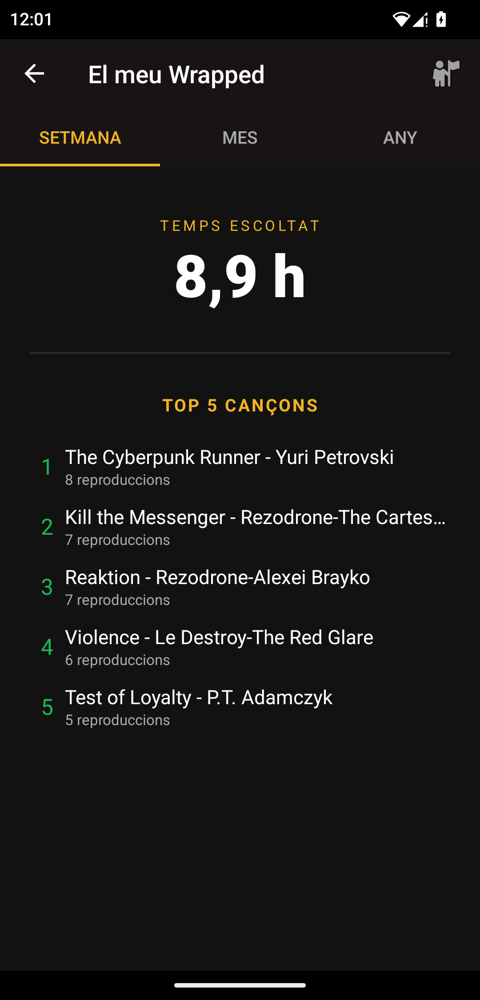
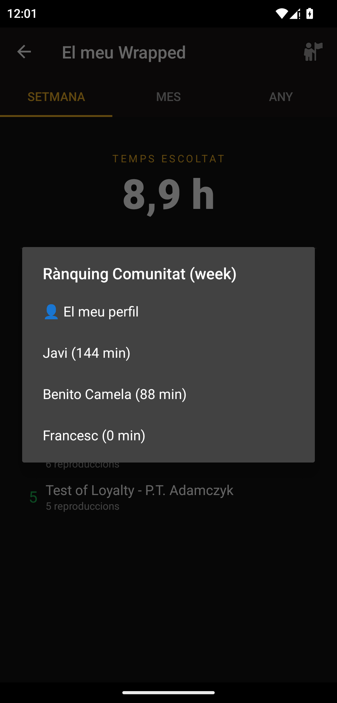

# ResoNode

**Self-hosted music streaming without barriers.**

ResoNode is a self-hosted music streaming platform designed to provide full control over a personal music library. It serves as an alternative to commercial streaming services, allowing users to host their own server and access their music remotely without subscriptions, ads, or data tracking.

## User Interface

<p align="center">
  
  
  
  
</p>

## Overview

Unlike other media servers like Plex or Jellyfin, ResoNode is built with a specific focus on resilience and connection simplicity for users with dynamic IPs.

* **Data Sovereignty:** You host the MP3 files. The library is not subject to licensing agreements or removals.
* **Connection Mechanism:** Removes the need for static IPs, dynamic DNS (DDNS), or complex VPN configurations (like WireGuard/Tailscale). It uses a secure discovery system based on **Cloudflare Tunnels and AES-Encrypted GitHub Gists** to locate the server automatically.
* **Hybrid Playback:**
    * **Streaming:** Plays directly from the server when an internet connection is available, using chunked streaming for fast loading.
    * **Offline Mode:** Downloads playlists to local storage. The app manages the local database transparently, switching modes automatically when network connectivity is lost.
* **The Vault:** An automated file system that organizes uploads by Artist, Album, and Track based on metadata.
* **Legacy Support:** Designed with a lightweight interface and a custom TLS 1.2 implementation, ensuring smooth performance even on older hardware (Android 4.4+) used as dedicated media players.

## System Architecture

<p align="center">

</p>

The project is structured into three main directories:

1.  **`/server` (Python/FastAPI):** Runs on the host machine. Manages the file system, user authentication, URL updating, and streaming logic.
2.  **`/user` (Python Tools):** Helper scripts (`deploy.py` and `music_uploader.py`) to manage your server remotely.
3.  **`/app` (Android Client):** A native application optimized for low-latency streaming and offline synchronization.

### The Connection Logic

To bypass carrier-grade NAT (CGNAT) and dynamic IPs without user intervention:

1.  **Tunneling:** A secure Cloudflare Tunnel (`cloudflared`) assigns a temporary, random public URL to the server.
2.  **Broadcasting:** Upon startup, the backend (`api_musica.py`) triggers a background script (`update_url.py`) that encrypts the new URL using AES-256 and patches a private GitHub Gist.
3.  **Discovery:** When the Android app launches (or loses connection), it fetches the GitHub Gist, decrypts the payload locally using the shared secret key, and updates its target URL.
4.  **Handshake:** The app establishes a direct, secure connection to the server seamlessly.

## ResoNode Wrapped

<p align="center">


</p>

An integrated, privacy-focused analytics engine designed to track listening habits without third-party data mining. Built with a **local-first** philosophy.

* **Offline-Persistent Tracking:** Playback history (duration and track counts) is recorded into an internal SQLite database.
* **Smart Synchronization:** The app detects when internet connectivity is restored and automatically pushes unsynced local logs to the server. 
* **Privacy & Community:** Strictly opt-in via Settings:
    * **OFF (Default):** The app does not record any data.
    * **Private Mode:** Statistics are strictly for personal viewing.
    * **Public Mode:** Opt-in to a server-wide leaderboard to compare listening times with other instance members.

## Server Installation

### Prerequisites
* Python 3.8 or higher.
* **Cloudflared:** The Cloudflare tunnel daemon must be installed and running.
* **GitHub Account:** A Personal Access Token (Classic) with `gist` permissions to update the dynamic URL.

### Setup Steps

1.  **Install Dependencies:**
    ```bash
    pip install fastapi uvicorn python-multipart mutagen requests cryptography
    ```

2.  **Configuration:**
    * Navigate to the `server/` directory.
    * Rename `server_config_template.py` to `server_config.py` (this file is git-ignored to prevent credential leakage).
    * Edit the file with your credentials:
        ```python
        API_SECRET_KEY = "YOUR_SECURE_KEY" # Used for app access and URL AES encryption
        ADMIN_SECRET_KEY = "YOUR_ADMIN_KEY" # Used for remote APK/Music uploads
        GITHUB_TOKEN = "ghp_your_personal_access_token"
        GIST_ID = "your_gist_id"
        PORT = 5000
        ```

3.  **Run the Server:**
    Execute the main API script. It will automatically start the background URL updater.
    ```bash
    cd server
    python api_musica.py
    ```

## Client Installation (Android)

1.  Open the project in **Android Studio**.
2.  **Security Configuration:**
    * Navigate to `app/src/main/java/com/example/resonode/`.
    * Rename or use `Config.java` to set up your environment.
    * Match the `API_SECRET_KEY` exactly with your server.
3.  **Build:** Compile the APK and install it on the target device.

## Remote Management Tools (`/user`)

ResoNode includes user-friendly helper scripts in the `/user` folder to manage your server without SSH access.

### Uploading Music (`music_uploader.py`)

1.  Navigate to the `user/` directory.
2.  Run the uploader script:
    ```bash
    python music_uploader.py
    ```
3.  **Follow the interactive wizard:**
    * Drag and drop your local music folder containing `.mp3` files.
    * Choose whether you are at home (Local IP) or away (fetches URL via Gist).
    * Select a target playlist or send it directly to the Vault.

The script filters for MP3s, zips them, and uses your `ADMIN_SECRET_KEY` to securely push them to the server for automatic ID3 extraction and sorting.

### OTA Updates (`deploy.py`)

ResoNode includes a built-in Over-The-Air update mechanism. You can deploy new code to your server remotely, and client apps will prompt users to download the update automatically.

1.  **Build:** Generate a Signed/Debug APK in Android Studio.
2.  Navigate to the `user/` directory and run:
    ```bash
    python deploy.py
    ```
3.  **Follow the wizard:**
    * It detects the latest compiled APK from the `app/build/` folder.
    * Enter the new Version Code and a Changelog.
    * Deploy via Local Network (SSH/SCP) or Remote Network (HTTP POST via Cloudflare using your `ADMIN_SECRET_KEY`).
